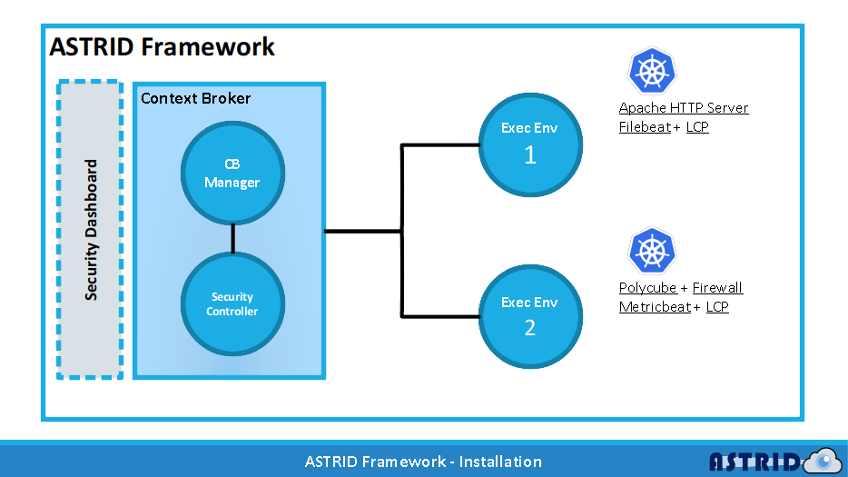

# ASTRID Framework - Installation Script

The installed components are:
- Context Broker (CB)
- 2 Execution Environments

For the CB two pods are deployed. The first one includes: 
- Kafka (https://kafka.apache.org)
- Logstash (https://www.elastic.co/logstash)
- Elasticsearch (https://www.elastic.co/elasticsearch)
- CB-Manager (https://github.com/astrid-project/cb-manager)
The second one includes:
- Security Controller (https://github.com/astrid-project/astrid-controller)

For the two execution environments, the two deployed pods includes:
1. Apache HTTP Server (https://httpd.apache.org) with Filebeat (https://www.elastic.co/beats/filebeat) agent.
2. Firewall (https://polycube.readthedocs.io/en/latest/services/pcn-firewall/firewall.html) eBPF program deployed with Polycube (https://github.com/polycube-network/polycube - Manual: https://polycube.readthedocs.io) with Metricbeat (https://www.elastic.co/beats/metricbeat) agent.



## Steps

1. Download the code or clone from __GitHub ASTRID repository__: [https://github.com/astrid-project/astrid-framework]
```bash
git clone https://github.com/ASTRID-project/astrid-framework
```

2. __Move__ into the _installation script_ folder
```bash
mv astrid-framework/installation-scripts
```

3 __Install__ the __ASTRID__ _Framework_ (CB and Controller)
```bash
bash ./install-core.sh -af 
```

4. __Set up__ a __first__ _Execution Environment_ with Apache HTTP Server and Filebeat
```bash
bash ./install-core.sh -ee 1 -f 
```

5. __Set up__ a __second__ _Execution Environment_ with Firewall eBPF program and Polycube
```bash
bash ./install-core.sh -ee 2 -pc
```

## Extra

To __change__ the __agent configurations__ and __see__ the __status__ of each __component__ __install__ the __ASTRID__ _Security Dashboard_ (https://github.com/ASTRID-project/security-dashboard) __Video__: https://github.com/ASTRID-project/security-dashboard/blob/master/cut.mp4
