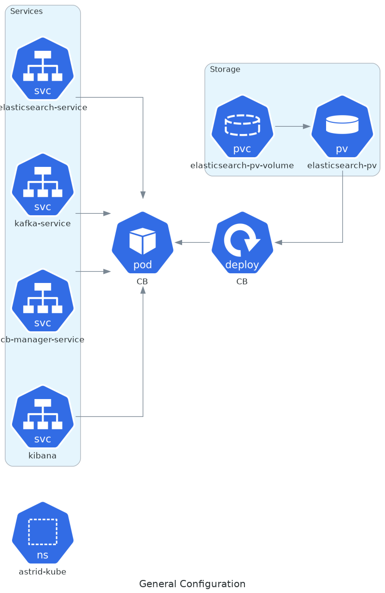
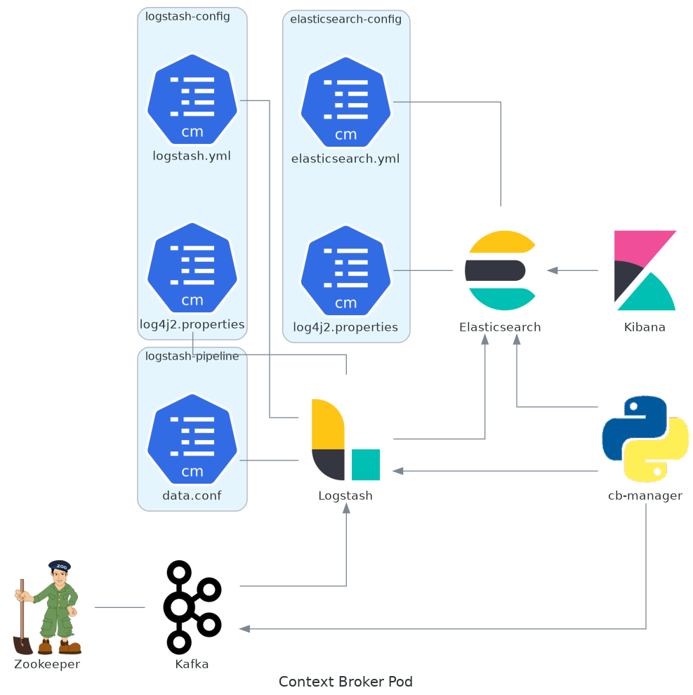

# README

This directory contains the manifest files used by Flux () for the CI / CD in a Kubernetes cluster installation.

These manifest files allows the configuration of the following ASTRID components:



- ``astrid-kube`` namespace
- Context-Broker (CB) pod [backend/context-broker-dev.yaml](backend/context-broker-dev.yaml)
    - CB-Manager
    - Elasticsearch
    - Logstash
    - Kibana
    - Kafka
    - Zookeeper



- Service [backend/service.yaml](backend/service.yaml)
    - CB-Manager
    - Kafka
    - Elasticsearch
    - Kibana

- Persistence Storage [backend/storage.yaml](backend/storage.yaml) Used by
    - Elasticsearch
    - Logstash
    - Kafka

- Config Map
    - Elasticsearch configuration [common/elasticsearch-config.yaml](common/elasticsearch-config.yaml)
    - Logstash
        - General configuration [common/logstash-config.yaml](common/logstash-config.yaml)
        - Pipeline configuration [common/logstashpipeline-config.yaml](common/logstashpipeline-config.yaml)

- Local Control Plane (LCP) pod [agens/lcp.yaml](agens/lcp.yaml) with the relative component as container

Alternatively, it is possible to apply this configuration without Flux executing the following command (works only with Linux):

```bash
,/run.sh dev
```
Actually the ``dev`` mode is the only one supported.
