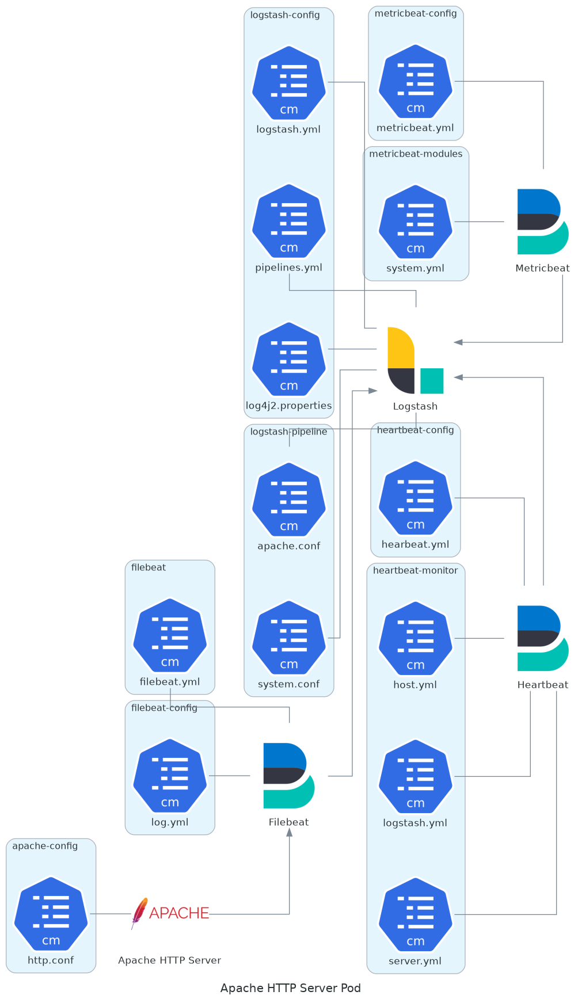
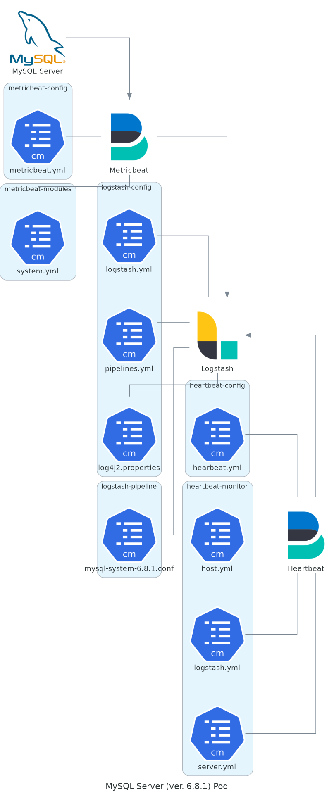

# README

This directory contains useful manifest to make test with the ASTRID framework.

Essentially the tests are performed with following software:

- [Apache HTTP Server](http://httpd.apache.org)
- [MySQL Server](https://www.mysql.com)
- [OpenSSH Server](https://www.openssh.com)

## Apache HTTP Server

The following manifest files

- [pod/apache-6.8.1.pod.yaml](pod/apache-6.8.1.pod.yaml)
- [pod/apache-7.0.1.pod.yaml](pod/apache-7.0.1.pod.yaml)

configure a Kubernetes pod with the following components: 

- Apache HTTP Server
- [LCP](../../agents/lcp/README.md)
- [Filebeat](https://www.elastic.co/beats/filebeat)
- [Metricbeat](https://www.elastic.co/beats/metricbeat)
- [Heartbeat](https://www.elastic.co/beats/heartbeat)
- [Logstash](https://www.elastic.co/logstash)

The different versions (6.8.1 and 7.0.1) are related to Elastic stack: Filebeat, Metricbeat, Heartbeat and Logstash.

## MySQL Server

The following manifest files

- [pod/mysql-6.8.1.pod.yaml](pod/mysql-6.8.1.pod.yaml)
- [pod/mysql-7.0.1.pod.yaml](pod/mysql-7.0.1.pod.yaml)

configure a Kubernetes pod with the following components: 

- MySQL Server
- [Metricbeat](https://www.elastic.co/beats/metricbeat)
- [Heartbeat](https://www.elastic.co/beats/heartbeat)
- [Logstash](https://www.elastic.co/logstash)

The different versions (6.8.1 and 7.0.1) are related to Elastic stack: Metricbeat, Heartbeat and Logstash.

## SSH Server

The following manifest files

- [pod/ssh-server-6.8.1.pod.yaml](pod/ssh-server-6.8.1.pod.yaml)
- [pod/ssh-server-7.0.1.pod.yaml](pod/ssh-server-7.0.1.pod.yaml)

configure a Kubernetes pod with the following components: 

- OpenSSH Server
- [Polycube](https://github.com/polycube-network/polycube)
- [Cubebeat](../../agents/cubebeat/README.md)
- [Metricbeat](https://www.elastic.co/beats/metricbeat)
- [Heartbeat](https://www.elastic.co/beats/heartbeat)
- [Logstash](https://www.elastic.co/logstash)

The different versions (6.8.1 and 7.0.1) are related to Elastic stack: Metricbeat, Heartbeat and Logstash.
